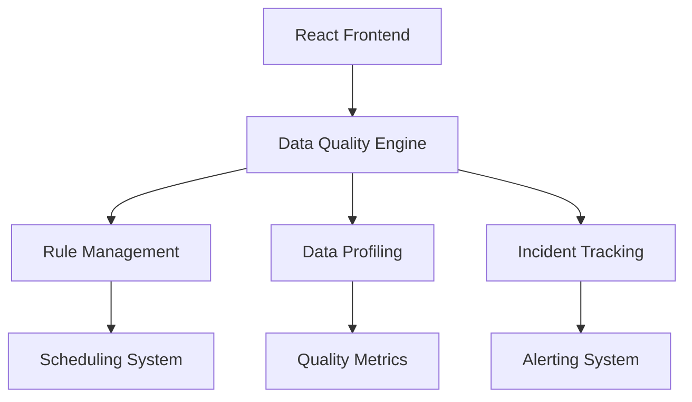

# 📊 Data Quality Monitoring Platform

<div align="center">

[](https://reactjs.org/)
[](https://www.typescriptlang.org/)
[](https://vitejs.dev/)
[](https://tailwindcss.com/)

**🚀 A modern, scalable platform for comprehensive data quality monitoring**

*Monitor • Validate • Improve your data quality across multiple sources*

[⚡ Quick Start](#-quick-start) • [🌟 Features](#-features) • [🏗️ Architecture](#️-architecture) • [📖 Documentation](#-documentation)

</div>

---

## 🌟 Features

### 🎛️ **Core Monitoring Capabilities**
- **📑 Smart Rule Management** - Create, schedule, and chain validation rules with visual builder
- **📊 Real-time Data Profiling** - Live quality metrics across completeness, uniqueness, validity, and consistency
- **⏱️ Execution History** - Comprehensive audit trail with advanced filtering and search
- **🔍 Centralized Observability** - Unified dashboard for monitoring data quality incidents

### 🛡️ **Enterprise-Grade Features**
- **🏛️ Data Governance** - SLA management, PII detection, and compliance reporting
- **💰 Cost Intelligence** - Storage optimization insights and query performance analytics
- **🎨 Modern User Experience** - Dark/light themes with responsive design
- **🔗 API-Ready Integration** - Mock data layer for rapid development and testing

---

## ⚡ Quick Start

### Prerequisites
- **Node.js** v18 or higher
- **npm** (included with Node.js)

### Installation

1. **Clone the repository**
   ```bash
   git clone <YOUR_GIT_URL>
   cd <YOUR_PROJECT_NAME>
   ```

2. **Install dependencies**
   ```bash
   npm install
   ```

3. **Start development server**
   ```bash
   npm run dev
   ```

4. **Open your browser**
   Navigate to [`http://localhost:5173`](http://localhost:5173)

### Available Scripts

| Command | Description |
|---------|-------------|
| `npm run dev` | Start development server |
| `npm run build` | Build for production |
| `npm run preview` | Preview production build |
| `npm run lint` | Run ESLint |

---

## 🏗️ Architecture

### Tech Stack

| Technology | Purpose | Version |
|------------|---------|---------|
| **React** | UI Framework | 18+ |
| **TypeScript** | Type Safety | 5.0+ |
| **Vite** | Build Tool | 5.0+ |
| **Tailwind CSS** | Styling | Latest |
| **shadcn/ui** | UI Components | Latest |

### System Overview



---

## 📂 Project Structure

```
src/
├── components/          # Reusable UI components
│   ├── Navbar/         # Navigation and branding
│   ├── DataTable/      # Advanced data grids
│   └── Sidebar/        # Navigation panel
├── pages/              # Application screens
│   ├── Dashboard/      # Main overview dashboard
│   ├── Rules/          # Rule management interface
│   ├── Profiling/      # Data quality metrics
│   └── Incidents/      # Issue tracking system
├── data/               # Mock data layer
│   ├── rules.json      # Sample validation rules
│   ├── metrics.json    # Quality metrics data
│   └── costs.json      # Cost analytics data
├── utils/              # Helper functions and utilities
│   └── api.ts          # Simulated API calls
├── App.tsx             # Root application component
└── main.tsx            # Application entry point
```

---

## 📖 Documentation

### Rule Management System

The platform supports hierarchical data quality rules organized by:
**Database → Schema → Table → Column**

#### Key Features:
- **Visual Rule Builder** - Create complex validation rules with an intuitive interface
- **Cron-based Scheduling** - Automate rule execution with flexible timing
- **Rule Chaining** - Create dependent execution flows for complex scenarios
- **Success Tracking** - Monitor pass/fail rates and performance metrics

### Data Profiling Engine

Real-time quality assessment across four key dimensions:

| Dimension | Description | Target |
|-----------|-------------|---------|
| **Completeness** | Percentage of non-null values | > 95% |
| **Uniqueness** | Duplicate detection rate | > 90% |
| **Validity** | Format and constraint compliance | > 95% |
| **Consistency** | Cross-reference validation | > 85% |

### Quality Metrics Dashboard

Monitor your data health with:
- Real-time quality scores
- Trend analysis and historical data
- Drill-down capabilities by database, schema, and table
- Automated alerting for quality degradation

---

## 🚀 Deployment

### Production Build

```bash
# Create optimized production build
npm run build

# Preview the production build locally
npm run preview
```

### Environment Variables

Create a `.env` file in the root directory:

```env
VITE_API_BASE_URL=https://your-api-endpoint.com
VITE_ENVIRONMENT=production
```

---

## 🤝 Contributing

1. Fork the repository
2. Create a feature branch (`git checkout -b feature/amazing-feature`)
3. Commit your changes (`git commit -m 'Add amazing feature'`)
4. Push to the branch (`git push origin feature/amazing-feature`)
5. Open a Pull Request

---

## 📄 License

This project is licensed under the MIT License - see the [LICENSE](LICENSE) file for details.

---


<div align="center">

**Made with ❤️ by Vikas for better data quality**

⭐ Star this repository if you find it helpful!

</div>
